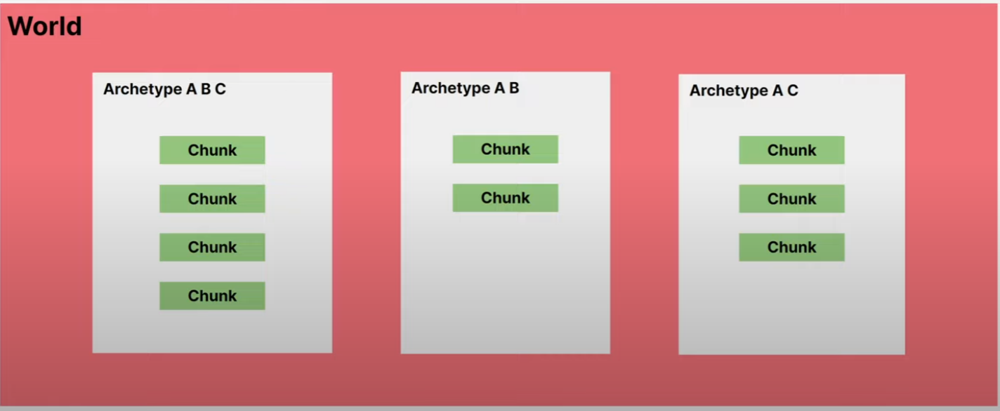
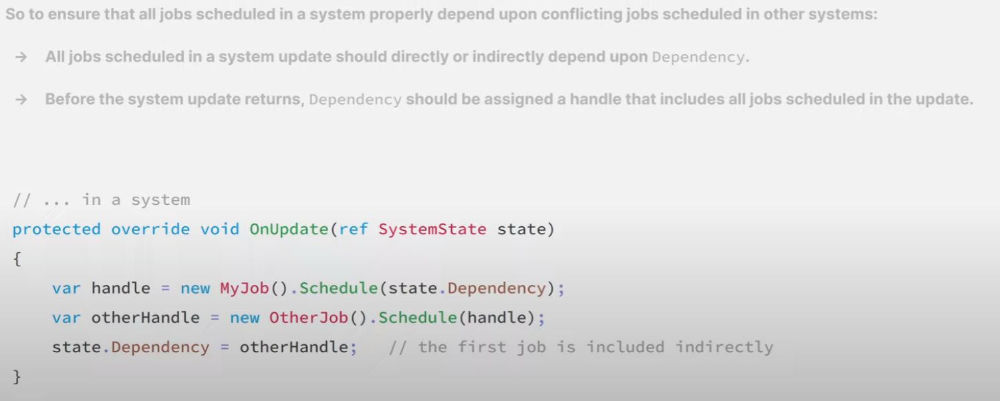
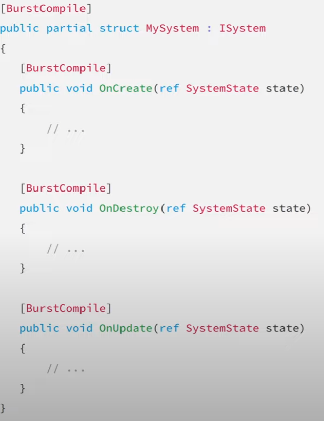

# World
Collection of entities (will mostly need 1 world)
- netcode creates 1 world for server, and 1 world for each client

## Archetype
- "container" that holds entities with certain component types
- actually stored in chunks within archetype
- adding components at runtime may be a bit slower bc it automatically moves the chunk to a different archetype
  - called a *structural change*
  - chunk can hold 128 entities

## Baking
- BUILD TIME conversion of gameobject to serialized entities

## Jobs
- **IJobChunk** : job that iterates over the chunks matching some query
  - Generally less conventient, but provides low level control
- **IJobEntity**: job that iterates over the entities matching a query
  - More convenient, but doesn't have some use cases

## Systems
- Units of code executed (usually) once per frame
- Each system instance belongs to the world
- SystemState includes the world and its EntityManager
  - GetEntityQuery()
  - GetComponentTypeHandle<T>()
  - use SystemState instead of EntityManager to get queries and component types, bc it auto registers them
  
- Can have SystemGroups, with child systems and child system groups
  - Systems are executed at "random" within SystemGroup but can specify with *[UpdateBefore(typeof(FooSystem))]* attribute (or *UpdateAfter*)
  - Can override SystemGroup OnUpdate to not update System or update System more than once in single frame
- Hitting play auto populates 3 system groups (Initialization, Simulation, and Presentation)
  - Custom systems will then be placed in Simulation, but can be placed in other SystemGroup with attribute

# Code Monkey Notes

### Subscenes
- anything in subscene will be created as an entity automatically

### Systems
SystemBase - for managed types (gameobjects, transforms, delegates)

ISystem - structs - unmanaged types (can use burst here) -- defaults should be isystem

RefRW - read and write components from systems

RefRO - just read
	- explicitly define which one, or it creates a copy (performance issues)